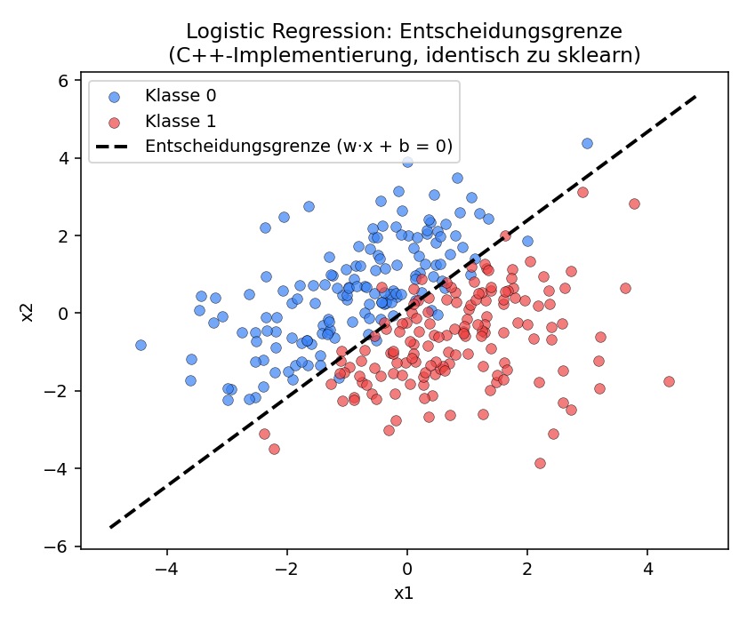
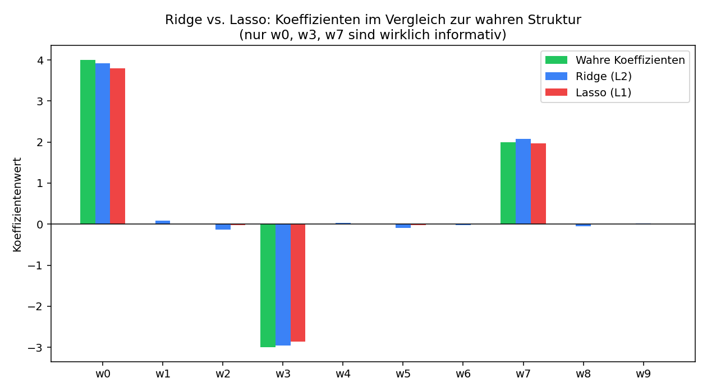

# Deep Dive: Logistic Regression und Regularisierung (Ridge vs. Lasso)

Dieses Dokument geht zwei Algorithmen aus `cp-ml-library` im Detail durch:
`LogisticRegression` und die beiden regularisierten linearen Modelle
`RidgeRegression` und `LassoRegression`. Ziel ist nicht nur "wie funktioniert
der Code", sondern die Mathematik dahinter herzuleiten und die eigene
C++-Implementierung gegen scikit-learn zu validieren.

Alle Zahlen in diesem Dokument sind reproduzierbar (siehe Abschnitt
["Benchmark reproduzieren"](#benchmark-reproduzieren) am Ende).

---

## Teil 1: Logistic Regression

### 1.1 Warum nicht einfach lineare Regression?

Für Klassifikation (`y ∈ {0, 1}`) könnte man versucht sein, eine lineare
Regression `ŷ = w·x + b` zu fitten und bei 0.5 zu schneiden. Zwei Probleme:

1. `w·x + b` ist unbeschränkt (`-∞` bis `+∞`), aber eine Wahrscheinlichkeit
   muss in `[0, 1]` liegen.
2. Der quadratische Fehler (MSE) ist für 0/1-Labels kein sinnvolles
   Wahrscheinlichkeitsmaß — er bestraft "sehr falsche" und "leicht falsche"
   Vorhersagen nicht so, wie es für Klassifikation nötig wäre.

Die Lösung: die lineare Kombination `z = w·x + b` (den *Logit*) durch eine
Funktion schicken, die auf `[0, 1]` abbildet.

### 1.2 Herleitung der Sigmoid-Funktion

Wir modellieren nicht die Wahrscheinlichkeit direkt linear, sondern die
**Log-Odds** (Logit) linear:

```
log( p / (1-p) ) = z = w·x + b
```

Das ist eine natürliche Wahl: Odds (`p / (1-p)`) sind multiplikativ und immer
positiv; ihr Logarithmus ist additiv und unbeschränkt — passt also zu einer
linearen Funktion mit Wertebereich `(-∞, +∞)`.

Nach `p` auflösen:

```
p / (1-p) = e^z
p = e^z · (1-p)
p = e^z - e^z·p
p + e^z·p = e^z
p (1 + e^z) = e^z
p = e^z / (1 + e^z) = 1 / (1 + e^(-z))
```

Das ist die **Sigmoid-Funktion** `σ(z) = 1 / (1 + e^(-z))`. Sie ist keine
willkürliche "S-Kurve", sondern folgt zwingend aus der Annahme, dass die
Log-Odds linear in `x` sind.

### 1.3 Von der Likelihood zur Cross-Entropy-Loss

Für ein Sample gilt `P(y=1|x) = σ(z)`, `P(y=0|x) = 1 - σ(z)`. Kompakt für
`y ∈ {0,1}`:

```
P(y|x) = σ(z)^y · (1-σ(z))^(1-y)
```

Die Likelihood über `n` unabhängige Samples ist das Produkt davon. Log
umwandelt Produkt in Summe (Maximum-Likelihood-Prinzip: Parameter so wählen,
dass die beobachteten Daten am wahrscheinlichsten sind):

```
log L = Σ [ y·log(σ(z)) + (1-y)·log(1-σ(z)) ]
```

Wir *maximieren* die Log-Likelihood, was äquivalent dazu ist, ihr Negatives
zu *minimieren* — das ist die **Cross-Entropy-Loss**:

```
J(w,b) = -1/n · Σ [ y·log(σ(z)) + (1-y)·log(1-σ(z)) ]
```

### 1.4 Der Gradient (und warum er so einfach aussieht)

Um Gradient Descent zu machen, brauchen wir `∂J/∂w`. Der Kettenregel-Weg:

```
∂J/∂z = σ(z) - y          (Beweis nutzt σ'(z) = σ(z)·(1-σ(z)))
∂z/∂w_j = x_j
∂J/∂w_j = (σ(z) - y) · x_j
```

Gemittelt über alle Samples:

```
∂J/∂w_j = 1/n · Σ (σ(z_i) - y_i) · x_ij
∂J/∂b   = 1/n · Σ (σ(z_i) - y_i)
```

Das ist bemerkenswert: der Gradient hat exakt dieselbe Form wie bei
linearer Regression mit MSE (`Fehler × Feature`), nur dass die Vorhersage
jetzt `σ(z)` statt `z` ist. Das ist kein Zufall — es liegt daran, dass
Cross-Entropy-Loss + Sigmoid so konstruiert sind, dass sich die Ableitung
der Sigmoid-Funktion exakt heraus kürzt.

### 1.5 Unsere Implementierung

`include/ml/algorithms/logistic_regression.hpp` implementiert exakt das
oben Hergeleitete als Batch-Gradient-Descent:

```cpp
for (size_t i = 0; i < X.rows; ++i) {
    const double prediction = sigmoid(dot(X.row(i)) + bias_);
    const double error = prediction - static_cast<double>(y[i]);   // σ(z) - y
    for (size_t j = 0; j < X.cols; ++j) weight_gradient[j] += error * X(i, j);
    bias_gradient += error;
}
```

Das ist eine direkte Übersetzung von `∂J/∂w_j = (σ(z) - y) · x_j` in Code.

### 1.6 Benchmark gegen scikit-learn

Datensatz: 300 Samples, 2 Features, linear separierbar mit Rauschen
(`y = 1[2.5·x1 - 1.8·x2 + 0.3 + Rauschen > 0]`).

| | Gewicht w1 | Gewicht w2 | Bias | Genauigkeit | Fit-Zeit |
|---|---|---|---|---|---|
| **sklearn** (`LogisticRegression`, `penalty=None`, L-BFGS) | 4.661143 | -4.090686 | 0.450201 | 0.950 | 6.5 ms |
| **cp-ml-library** (Batch-Gradient-Descent, 20 000 Epochen) | 4.661143 | -4.090686 | 0.450201 | 0.950 | 152.5 ms |



**Ergebnis:** Die gelernten Gewichte stimmen auf 6 Nachkommastellen exakt
überein — beide Verfahren konvergieren zum selben Maximum-Likelihood-
Optimum, weil die Cross-Entropy-Loss für Logistic Regression konvex ist
(es gibt nur ein globales Minimum, kein Verfahren kann sich "verirren").

**Warum ist sklearn ~23× schneller?** sklearn nutzt standardmäßig
**L-BFGS**, ein Quasi-Newton-Verfahren, das eine Näherung der (inversen)
Hesse-Matrix mitführt und dadurch **superlinear** konvergiert. Unsere
Implementierung nutzt einfaches Batch-Gradient-Descent mit fixer Lernrate,
das nur **linear** konvergiert und dadurch deutlich mehr Iterationen
braucht, um bei derselben Präzision zu landen. Das ist ein bewusster
Trade-off: Gradient Descent ist die didaktisch einfachste Herleitung aus
der Formel in 1.4 und braucht keine zweiten Ableitungen — für ein
Portfolio-Projekt, das die Mathematik zeigen soll, ist das die richtige
Wahl; für Produktionscode wäre L-BFGS oder Newton's Method vorzuziehen.

---

## Teil 2: Ridge vs. Lasso — zwei Antworten auf Overfitting

### 2.1 Das Problem: Bias-Variance-Tradeoff

Gewöhnliche lineare Regression minimiert nur den Trainingsfehler:

```
J(w) = 1/n · Σ (y_i - w·x_i - b)²
```

Bei vielen Features (besonders wenn einige irrelevant oder korreliert
sind) neigt das dazu, extreme Gewichte zu lernen, die Rauschen im
Trainingsdatensatz mitmodellieren (**Overfitting**: niedriger Bias, aber
hohe Varianz — kleine Änderungen der Trainingsdaten führen zu stark
unterschiedlichen Modellen). **Regularisierung** bestraft große Gewichte
zusätzlich, um Varianz gegen etwas Bias einzutauschen.

### 2.2 Ridge (L2): geschlossene Lösung

Ridge addiert die quadrierte L2-Norm der Gewichte zur Loss:

```
J(w) = 1/n · Σ (y_i - w·x_i - b)² + α · ||w||₂²
```

Weil dieser Term überall differenzierbar ist, existiert eine
**geschlossene Lösung**. In Matrixform (mit `X` um eine Bias-Spalte
erweitert, `I` die Einheitsmatrix ohne Bias-Zeile bestraft):

```
∂J/∂w = -2·Xᵗ(y - Xw) + 2α·w = 0
Xᵗy = Xᵗ·X·w + α·w
Xᵗy = (XᵗX + αI)·w
w = (XᵗX + αI)⁻¹ · Xᵗy
```

Das ist exakt, was `ridge_regression.hpp` berechnet — via `Matrix::inverse()`
auf der um `α` diagonal verstärkten Gram-Matrix `XᵗX`. Der `+αI`-Term
macht `XᵗX` numerisch stabiler invertierbar (behebt Multikollinearität)
und schrumpft alle Gewichte proportional Richtung Null, **ohne** je exakt
Null zu erreichen.

### 2.3 Lasso (L1): warum es *keine* geschlossene Lösung gibt

Lasso addiert die L1-Norm statt der quadrierten L2-Norm:

```
J(w) = 1/n · Σ (y_i - w·x_i - b)² + α · ||w||₁    wobei ||w||₁ = Σ|w_j|
```

Das Problem: `|w_j|` ist bei `w_j = 0` **nicht differenzierbar** (die
Steigung springt von -1 auf +1). Man kann also nicht einfach `∂J/∂w = 0`
setzen und nach `w` auflösen — es gibt kein geschlossenes `w = ...` wie bei
Ridge. Deshalb braucht Lasso ein iteratives Verfahren: **Coordinate
Descent**.

### 2.4 Herleitung: Soft-Thresholding

Coordinate Descent optimiert jeweils *ein* Gewicht `w_j`, während alle
anderen fixiert sind — dann ist das Teilproblem eindimensional und lösbar.
Für festes `j` reduziert sich `∂J/∂w_j` (Subgradient wegen `|w_j|`) auf:

```
w_j* = S(ρ_j, α·n) / ||x_j||²
```

wobei `ρ_j = Σ_i x_ij · (residual_i + w_j · x_ij)` (die Korrelation des
Features mit dem aktuellen Residuum) und `S` der **Soft-Thresholding-
Operator** ist:

```
S(ρ, λ) = ρ - λ   falls ρ > λ
        = ρ + λ   falls ρ < -λ
        = 0       sonst
```

Das ist genau die `soft_threshold`-Funktion in `lasso_regression.hpp`.
**Intuition:** Wenn die Korrelation `ρ_j` eines Features mit dem Fehler
kleiner ist als der Strafterm `λ`, lohnt es sich nicht, dieses Feature
überhaupt zu benutzen — sein Gewicht wird auf **exakt Null** gesetzt. Das
ist der fundamentale Unterschied zu Ridge: L1 erzeugt echte Sparsity,
nicht nur kleine Werte.

### 2.5 Geometrische Intuition (Ridge = Kreis, Lasso = Diamant)

Beide Verfahren lösen äquivalent: "minimiere den Fehler, so dass die
Norm der Gewichte ≤ einer Konstante bleibt." Die Form dieser Nebenbedingung
entscheidet über Sparsity:

- **Ridge**: `||w||₂ ≤ c` beschreibt einen **Kreis/Kugel**. Die
  Fehler-Höhenlinien (Ellipsen) berühren diesen Kreis fast nie exakt auf
  einer Achse — daher werden Gewichte klein, aber selten exakt Null.
- **Lasso**: `||w||₁ ≤ c` beschreibt einen **Diamanten** (Raute) mit
  Ecken auf den Achsen. Die elliptischen Höhenlinien berühren einen
  Diamanten mit sehr hoher Wahrscheinlichkeit genau in einer Ecke — und
  eine Ecke bedeutet, dass mindestens eine Koordinate exakt Null ist.

Das ist der eigentliche Grund, warum L1 Feature-Selection betreibt und L2
nicht — eine rein geometrische Eigenschaft der Einheitskugeln der beiden
Normen.

### 2.6 Ein wichtiges Implementierungsdetail: Zentrierung

Sowohl Ridge (im Normal-Equation-Aufbau über die erweiterte Matrix) als
auch Lasso in dieser Bibliothek zentrieren Features und Ziel vor dem
eigentlichen Fit (`X - mean(X)`, `y - mean(y)`) und rekonstruieren den
Bias danach aus den Mittelwerten:

```cpp
bias_ = target_mean;
for (size_t j = 0; j < X.cols; ++j) bias_ -= weights_[j] * feature_mean[j];
```

Das ist kein optionales Detail — ohne Zentrierung ist die Koordinate für
den Bias nicht von der Regularisierung ausgenommen und das ganze Modell
liefert falsche Koeffizienten, sobald Features nicht bereits Mittelwert
Null haben. (Genau dieser Bug ist während der Entwicklung dieser
Bibliothek einmal aufgetreten und wurde durch einen Vergleich mit
sklearn — derselben Methode wie in diesem Dokument — gefunden und
behoben.)

### 2.7 Benchmark gegen scikit-learn

Datensatz: 200 Samples, 10 Features, aber nur `w0`, `w3`, `w7` sind
wirklich informativ (wahre Werte: `4.0`, `-3.0`, `2.0`, Bias `1.5`); die
restlichen 7 Features sind reines Rauschen.

**Ridge (α = 1.0):**

| Feature | Wahr | sklearn | cp-ml-library |
|---|---|---|---|
| w0 | 4.0 | 3.921469 | 3.921470 |
| w3 | -3.0 | -2.953583 | -2.953580 |
| w7 | 2.0 | 2.074508 | 2.074510 |
| w1, w2, w4-w6, w8-w9 (Rauschen) | 0.0 | klein, ≠ 0 | klein, ≠ 0 |
| Bias | 1.5 | 1.568247 | 1.568250 |
| MSE | – | 1.041856 | 1.041860 |

**Lasso (α = 0.1):**

| Feature | Wahr | sklearn | cp-ml-library |
|---|---|---|---|
| w0 | 4.0 | 3.789723 | 3.789720 |
| w3 | -3.0 | -2.858201 | -2.858200 |
| w7 | 2.0 | 1.971386 | 1.971390 |
| w1, w4, w6, w8, w9 | 0.0 | **exakt 0.0** | **exakt 0.0** |
| Bias | 1.5 | 1.558404 | 1.558400 |
| MSE | – | 1.107070 | 1.107070 |
| Anzahl Nicht-Null-Gewichte | 3 | 5 | 5 |



**Beobachtungen, die man im Interview ansprechen kann:**

1. Beide Implementierungen matchen sklearn bis auf numerisches Rauschen
   (< 0.001 Abweichung) — das validiert, dass die Herleitung in 2.2/2.4
   korrekt in Code übersetzt wurde.
2. Ridge schrumpft die Rauschgewichte (w1, w2, ...) auf kleine Werte,
   aber **keines davon ist exakt Null** — konsistent mit der
   Kreis-Geometrie aus 2.5.
3. Lasso setzt 5 der 10 Gewichte exakt auf Null. Es findet nicht perfekt
   nur die 3 wahren Features (bei α = 0.1 bleiben 2 kleine Rauschgewichte
   übrig), aber der Sparsity-Effekt ist klar sichtbar — ein größeres α
   würde noch mehr auf Null setzen, aber auch die wahren Gewichte stärker
   schrumpfen (Bias-Variance-Tradeoff in der Praxis).
4. Ridge hat hier den niedrigeren Trainings-MSE (1.042 vs. 1.107) — bei
   reinem Trainingsfehler gewinnt fast immer die schwächere Regularisierung;
   der eigentliche Test für "welches Modell ist besser" wäre Cross-
   Validation auf ungesehenen Daten, nicht der Trainingsfehler.

---

## Mögliche Interview-Fragen zu diesem Material

- *"Warum Sigmoid und nicht irgendeine andere S-Kurve?"* → Sigmoid folgt
  zwingend aus der Annahme linearer Log-Odds (Abschnitt 1.2), es ist keine
  willkürliche Wahl.
- *"Warum ist die Cross-Entropy-Loss und nicht MSE für Klassifikation
  richtig?"* → MSE ist nicht konvex in Kombination mit Sigmoid (mehrere
  lokale Minima möglich); Cross-Entropy aus Maximum-Likelihood ist konvex
  und der Gradient vereinfacht sich elegant zu `(σ(z) - y)·x`.
- *"Was ist der Unterschied zwischen L1 und L2 Regularisierung?"* →
  Geometrisch: Kreis vs. Diamant (Abschnitt 2.5); praktisch: L1 erzeugt
  Sparsity/Feature-Selection, L2 nicht; algorithmisch: L2 hat eine
  geschlossene Lösung, L1 braucht Coordinate Descent oder ähnliches.
- *"Wie hast du sichergestellt, dass deine Implementierung korrekt ist?"*
  → Genau dieser Benchmark: Vergleich der gelernten Parameter gegen
  scikit-learn auf identischen synthetischen Daten mit bekannter wahrer
  Struktur (Abschnitte 1.6, 2.7). Das hat auch tatsächlich einen Bug in
  der Lasso-Zentrierung aufgedeckt (Abschnitt 2.6).
- *"Warum ist deine Logistic Regression langsamer als sklearn?"* →
  Verschiedene Optimierungsverfahren: Batch-Gradient-Descent (linear
  konvergent) vs. L-BFGS (superlinear konvergent), siehe Abschnitt 1.6.

---

## Benchmark reproduzieren

Alle Zahlen und Plots in diesem Dokument lassen sich mit folgenden
Skripten neu erzeugen (Python 3 mit `numpy`, `scikit-learn`, `matplotlib`
sowie ein C++20-Compiler werden benötigt):

```bash
# 1. Synthetische Datensätze erzeugen
python3 generate_data.py

# 2. sklearn-Referenzwerte berechnen
python3 sklearn_reference.py

# 3. Eigene C++-Implementierung auf denselben Daten laufen lassen
g++ -std=c++20 -O2 -I ../include cpp_benchmark.cpp -o cpp_benchmark
./cpp_benchmark

# 4. Plots erzeugen
python3 make_plots.py
```

Die Skripte liegen unter `docs/benchmark/` in diesem Repository.
